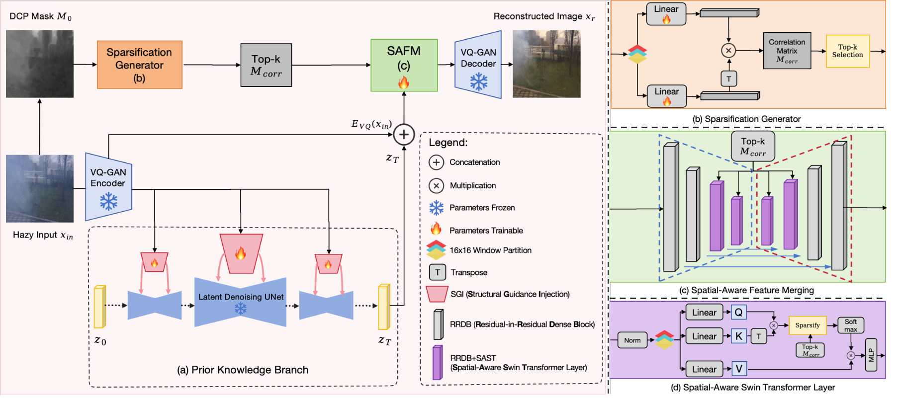
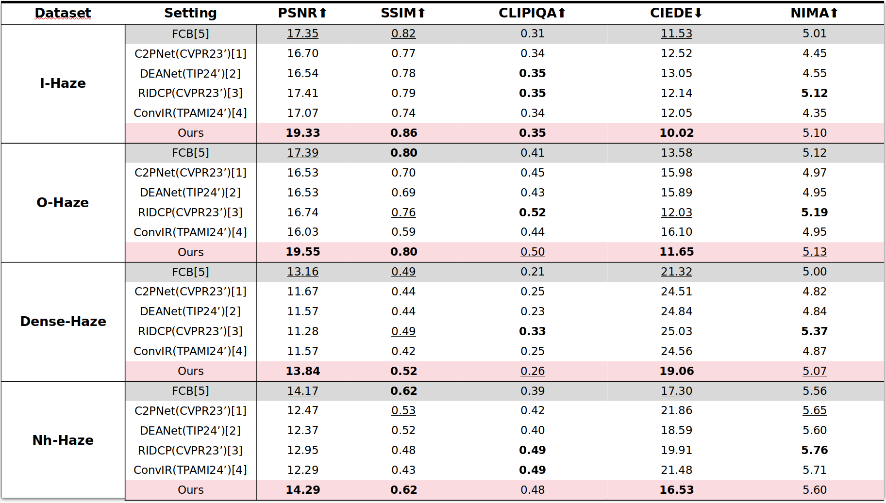
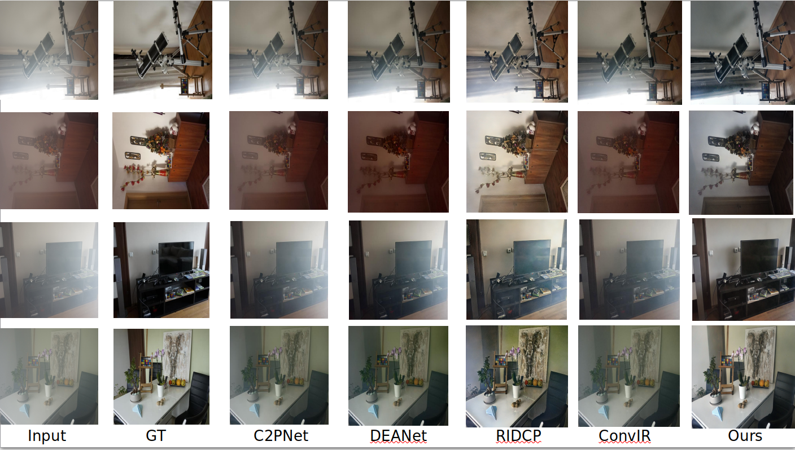
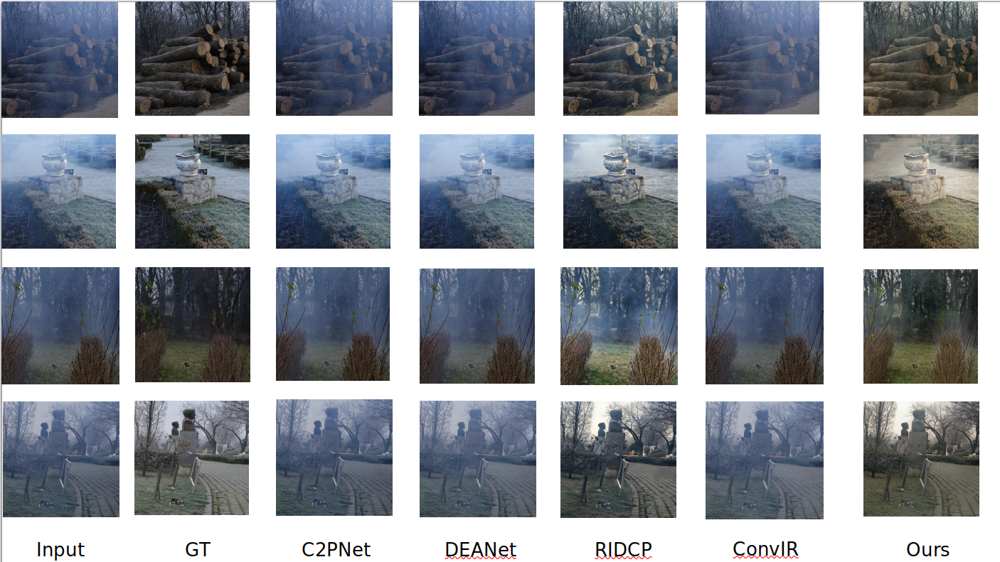
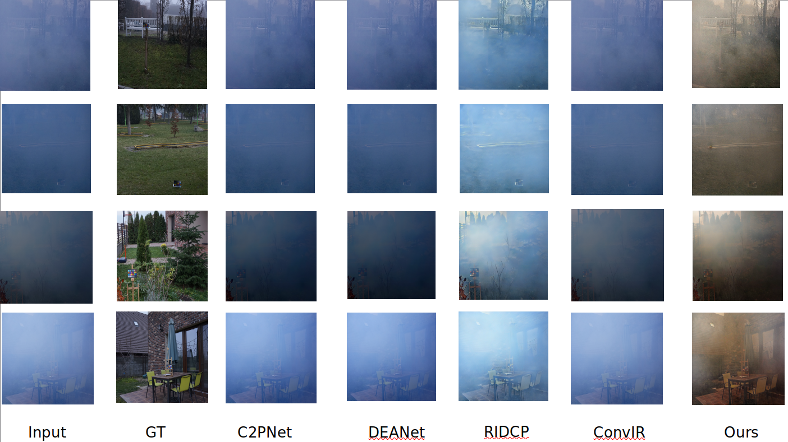
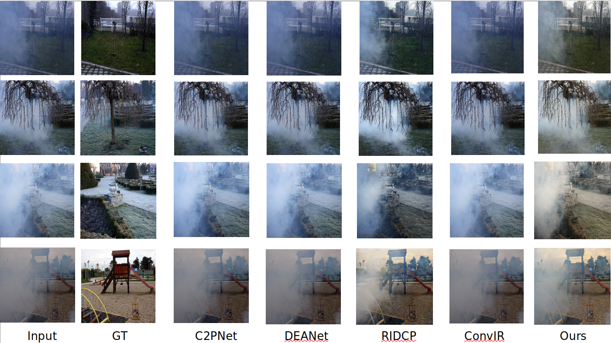

# Latent Dehazing

Tianwen Zhou

## Getting Started
### Installation
* This repo is a modification on the [StableSR Repo](https://githubcom/IceClear/StableSR.git)
* Install conda environment
```
cd LatentDehazing/

# Create a conda environment and activate
conda env create --file environment.yaml
conda activate stablesr

# Install taming-transformer and clip
pip install -e git+https://github.com/CompVis/taming-transformers.git@master#egg=taming-transformers
pip install -e git+https://github.com/openai/CLIP.git@main#egg=clip
pip install -e .
```

### Prior Knowledge Branch

#### Training Data
We use RESIDE dataset for training the prior knowledge branch.
```
# Usage of the training set
intern@43.82.40.65:/home/intern/ztw/ztw/ztw/Data/RESIDE_new

# File structure
/RESIDE_new/
├── HR # ground-truth images.
├── HR_hazy_src # hazy images from the OFFICIAL reside dataset
└── HR_depth # depth images (Generated by DepthAnything (https://github.com/LiheYoung/Depth-Anything))

```

#### Training script
Train the prior knowledge branch by finetuning the pre-trained SD-v2.1 model

Before training, modify the ckpt_path in config files ([Line 22](configs/LatentDehazing/v2-finetune_text_512.yaml#L22) and [Line 55](configs/LatentDehazing/v2-finetune_text_512.yaml#L55)) to the following location

Also modify the 'gt_path', 'dataroot_path', 'ref_path' in the [data part of the config file](configs/LatentDehazing/v2-finetune_text_512.yaml#L109) to the location of your ground-truth image, depth images, hazy images
```
# Location of the pre-trained SD-v2.1 model
intern@43.82.40.65:/home/intern/ztw/ztw/ztw/Methods/LatentDehazing/src/stable_diffusion-v2-1_512/v2-1_512-ema-pruned.ckpt

# Training script
# This training script will automatically save model checkpoints in ./logs/NAME/checkpoints
python main,py --train --base configs/LatentDehazing/v2-finetune_text_512.yaml --gpus GPU_ID, --name NAME --scaled_lr False

# If you want to resume training from a specific checkpoint, use
python main,py --train --base configs/LatentDehazing/v2-finetune_text_512.yaml --gpus GPU_ID, --resume CKPT_PATH --scaled_lr False
```

### SAFM (Spatial-Aware Feature Merging) Module Training
#### Data preparation 
You have to generate the training data for SAFM using the LDM that you finetuned previously, modify the ckpt_path in config files ([Line 53](configs/LatentDehazingData/test_data.yaml#L53)) with the finetuned LDM 

In our paper, we generated 60k paired training data for SAFM
```
# Generate SAFM Training Data with finetuned LDM_CKPT

python scripts/generate_vqgan_data.py --config configs/LatentDehazingData/test_data.yaml --ckpt CKPT --outdir OUTDIR --ddpm_steps 200 --base_i 0 --seed 10000

# Structure of the generated training data

CFW_trainingdata/
    └── inputs
          └── 00000001.png # Synthesized hazy images, (512, 512, 3) 
          └── ...
    └── gts
          └── 00000001.png # Corresponding groundtruth images, (512, 512, 3) 
          └── ...
    └── latents
          └── 00000001.npy # Latent vectors (.npy) (N, 4, 64, 64) of HR images generated by the latent denoising U-Net.
          └── ...
    └── samples
          └── 00000001.png # The HR images generated from latent codes, just to make sure the generated latents are correct.
          └── ...

# The training data we have generated is saved at:
intern@43.82.40.65:/home/intern/ztw/ztw/ztw/Data/CFW_training_data
```
#### Training Script
First, modify the 'gt_path' in the config file ([Line 48](configs/autoencoder/autoencoder_kl_64x64x4_resi_offline.yaml#L48) and [Line 54](configs/autoencoder/autoencoder_kl_64x64x4_resi_offline.yaml#L54)) to the path of training data you have generated
```
# Train SAFM:
# This training script will automatically save model checkpoints in ./logs/NAME/checkpoints, it will also store the samples and reconstructed results in ./logs/NAME/images

python main.py --train --base  configs/autoencoder/autoencoder_kl_64x64x4_resi_offline.yaml --gpus GPU_ID, --name NAME --scaled_lr False

# If you want to resume training from saved checkpoints:

python main.py --train --base configs/autoencoder/autoencoder_kl_64x64x4_resi_offline.yaml --gpus GPU_ID, --resume CKPT --scaled_lr False
```

## Test & Evaluation
### Pre-trained Models
Our pre-trained models can be found at
```
# Finetuned LDM:
intern@43.82.40.65:/home/intern/ztw/ztw/ztw/Methods/LatentDehazing/src/Finetuned_LDM_best.ckpt

# Pretrained SAFM:
intern@43.82.40.65:/home/intern/ztw/ztw/ztw/Methods/LatentDehazing/src/AE_best.ckpt
```
### Testing Sets:
We use four real-world **paired** testing set (I-Haze, O-Haze, DenseHaze, NhHaze) and one real-world **blind**s testing set (RTTS) to evaluate our proposed method.

Note: We resize the testing set to (512, 512, 3) while testing

You can find the testing sets at
```
intern@43.82.40.65:/home/intern/ztw/ztw/ztw/Data/I-HAZE-PROCESS
intern@43.82.40.65:/home/intern/ztw/ztw/ztw/Data/O-HAZE-PROCESS
intern@43.82.40.65:/home/intern/ztw/ztw/ztw/Data/DenseHaze
intern@43.82.40.65:/home/intern/ztw/ztw/ztw/Data/NhHaze
intern@43.82.40.65:/home/intern/ztw/ztw/ztw/Data/JPEGImages

# Structure of the testing data
{Dataset_name}/
    └── HR
          └── 01.png # Groundtruth Image 
          └── ...
    └── HR_hazy
          └── 01.png # Hazy Input 
          └── ...

```
### Test script
Modify the path of the SAFM config file ([Line 240](scripts/sr_val_ddpm_text_T_vqganfin_oldcanvas.py#L240))
```
# Start sampling with the finetuned LDM and pre-trained SAFM module
# dec_w indicates the weight of the SAFM, default = 1.0

python scripts/sr_val_ddpm_text_T_vqganfin_oldcanvas.py --config configs/LatentDehazing/v2-finetune_text_T_512.yaml --ckpt CKPT_PATH --vqgan_ckpt VQGANCKPT_PATH --init-img INPUT_PATH --outdir OUT_DIR --ddpm_steps 200 --dec_w 1 --colorfix_type nofix
```
### Evaluation
Since we resize the input image to (512, 512, 3) when testing, we have to quantitative evaluate it with resized ground truth images

We utilize PSNR, SSIM, CLIPIQA, CIEDE, NIMA to exhibit the superiority of our proposed method compared to other methods.
```
# You can find the resized ground truth images (512, 512, 3) at:
intern@43.82.40.65:/home/intern/ztw/ztw/ztw/Data/Resize_IHaze #(OHaze,DenseHaze,NhHaze)

# Calculating Metrics:
cd core/

# Modify the HR_PATH and SR_PATH in eval.sh to the folders you want to evaluate on
bash eval.sh
```
## Results
### Quantitative Results




[1] Curricular Contrastive Regularization for Physics-aware Single Image Dehazing, Zheng, Yu and Zhan, Jiahui and He, Shengfeng and Dong, Junyu and Du, Yong, IEEE/CVF Conference on Computer Vision and Pattern Recognition,2023.

[2] DEA-Net: Single image dehazing based on detail-enhanced convolution and content-guided attention, Chen, Zixuan and He, Zewei and Lu, Zhe-Ming,IEEE Transactions on Image Processing, 2024.

[3] RIDCP: Revitalizing Real Image Dehazing via High-Quality Codebook Priors, Wu, Ruiqi and Duan, Zhengpeng and Guo, Chunle and Chai, Zhi and Li, Chongyi, Proceedings of the IEEE/CVF Conference on Computer Vision and Pattern Recognition, 2023.

[4] Revitalizing Convolutional Network for Image Restoration, Cui, Yuning and Ren, Wenqi and Cao, Xiaochun and Knoll, Alois, IEEE Transactions on Pattern Analysis and Machine Intelligence, 2024.\

[5] Frequency compensated diffusion model for real-scene dehazing, Wang, Jing, Songtao Wu, Zhiqiang Yuan, Qiang Tong, and Kuanhong Xu, Neural Networks 175, 2024.

### Visual Comparison
#### I-Haze


#### O-Haze


#### Dense-Haze


#### Nh-Haze

## Latent Dehazing


[Tianwen Zhou](https://zhoutianwen.com/)

AI Lab, Sony

This is the offici